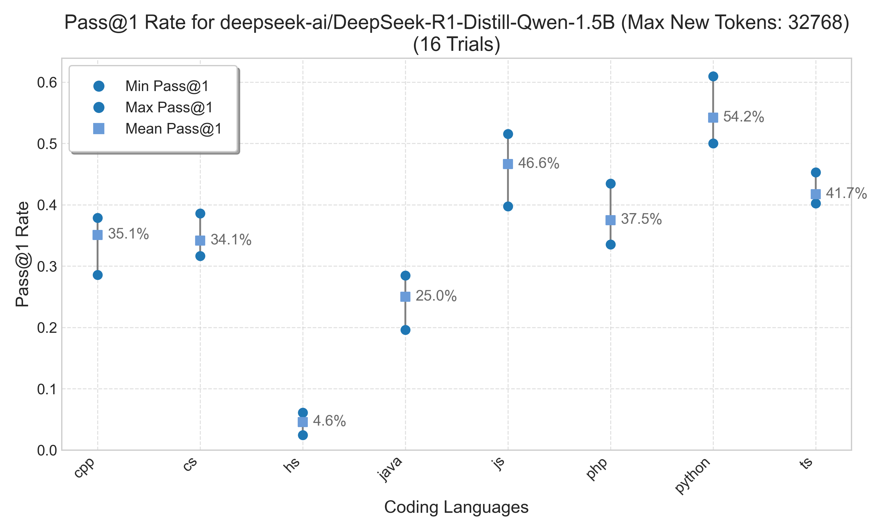

# HumanEval Code Generation Benchmarks

## 1. Introduction

This repository provides a framework for evaluating the performance of large language models, specifically focusing on code generation benchmarks. We leverage and extend the widely-used HumanEval benchmarks, including [HumanEval-Python](https://huggingface.co/datasets/openai_humaneval) and [HumanEval-Multilingual](https://huggingface.co/datasets/nuprl/MultiPL-E).

**Credit:** This evaluation setup is significantly inspired by and utilizes components from the [DeepSeek-Coder HumanEval repository](https://github.com/deepseek-ai/DeepSeek-Coder/tree/main/Evaluation/HumanEval). We extend our gratitude to the DeepSeek-AI team for their foundational work.

## 2. My Contributions

My contributions to this project include:

*   **DeepSeek Reasoning Model Compatibility:** I have amended existing codebases to ensure compatibility and optimal performance with the DeepSeek reasoning model.
*   **HumanEval-Haskell Test Set:** A new test set for HumanEval-Haskell has been integrated to broaden the evaluation scope to functional programming languages. The solutions within this set are primarily sourced from [AISE-TUDelft/HaskellCCEval](https://github.com/AISE-TUDelft/HaskellCCEval). Please note that while efforts have been made to curate these solutions, not all currently represent the definitive correct answers and may require further validation.

## 3. Evaluation

Evaluations are configured for execution within a Slurm environment. To run the Python evaluation script, please use the following command:

```bash
sbatch eval_script/eval_python.sh
```

For other languages or custom evaluation scenarios, please refer to the `eval_script/` directory for additional scripts or adapt the existing ones to your specific needs.

## 4. Results

The performance metrics for the `DeepSeek_R1_Distill_Qwen_1.5B_max_tokens_32768` model on the `pass@1` metric are visualized below:

